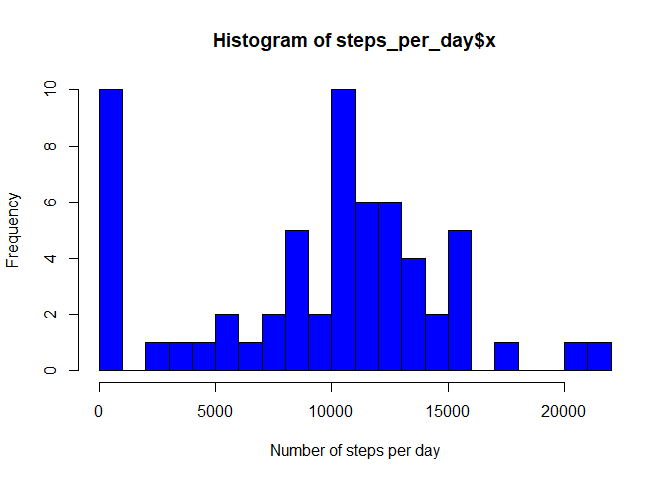
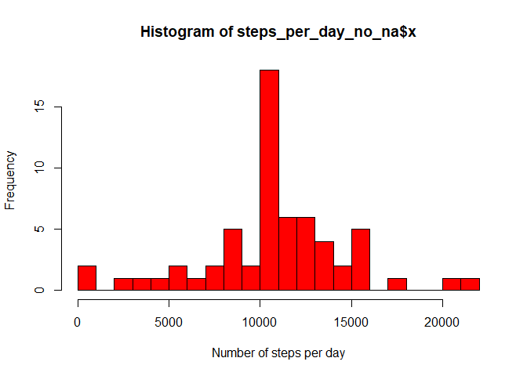
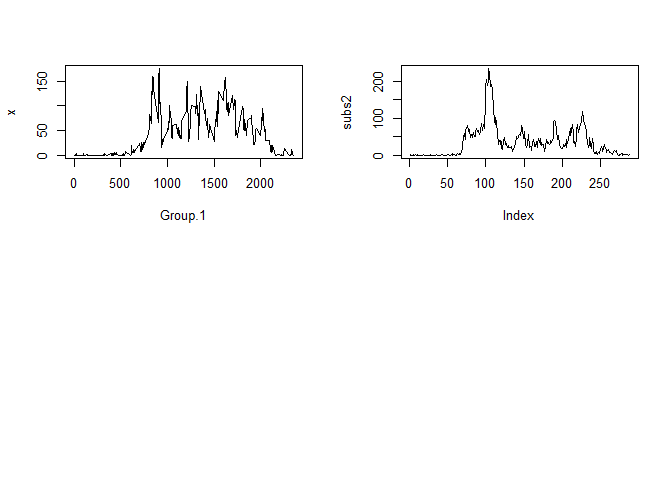

In this assignment, we explore the movement data gathered by an anonymous individual. The data is comprised of a step counter and a time stamp, that is the date and a five minute interval of the day. In particular, we load the data and then compile summary statistics and produce graphics in order to answer some basic questions about the patterns in this indivual's physical activity.

## Loading and preprocessing the data

### 1. Load the data (i.e.read.csv())

First, we set up a working directory using the *setwd()* function. Then we load the data from that directory into R memory, invoking the *read.csv()* function and storing the dataframe under a name using the <- operator: 

```r
setwd("C:/Users/d_mic/Desktop/David Michelsen/Coursera/Data Science Specialization/5 Reproducible Research/repdata_data_activity")
activity <- read.csv("C:/Users/d_mic/Desktop/David Michelsen/Coursera/Data Science Specialization/5 Reproducible Research/repdata_data_activity/activity.csv",stringsAsFactors = FALSE)
```
To make sure that the data was loaded correctly, we take a quick look at the first observations:


```r
head(activity)
```

```
##   steps       date interval
## 1    NA 2012-10-01        0
## 2    NA 2012-10-01        5
## 3    NA 2012-10-01       10
## 4    NA 2012-10-01       15
## 5    NA 2012-10-01       20
## 6    NA 2012-10-01       25
```

As can be seen, the steps column contains missing values for the first six observations. This is an issue which we will address later. We can also inspect the last observations:


```r
tail(activity)
```

```
##       steps       date interval
## 17563    NA 2012-11-30     2330
## 17564    NA 2012-11-30     2335
## 17565    NA 2012-11-30     2340
## 17566    NA 2012-11-30     2345
## 17567    NA 2012-11-30     2350
## 17568    NA 2012-11-30     2355
```


### 2. Process/transform the data (if necessary) into a format suitable for your analysis

Prior to carrying out analyses, pre-processing of the data may need to be carried out. Let's inspect the imported object and its properties:

```r
str(activity)
```

```
## 'data.frame':	17568 obs. of  3 variables:
##  $ steps   : int  NA NA NA NA NA NA NA NA NA NA ...
##  $ date    : chr  "2012-10-01" "2012-10-01" "2012-10-01" "2012-10-01" ...
##  $ interval: int  0 5 10 15 20 25 30 35 40 45 ...
```

The date has been imported as a string variable in the dataframe but in order to carry out calculations on it (checking the day of the week), it must be converted to a date, one of the atomic data types in R. So, we use the *as.Date.character conversion*, specifying the object and the column (*activity$date*) and the format. As was seen above, the dates are composed of four digits for the year, a dash, two digits for the month, and finally two digits for the day. The corresponding format is *%Y-%m-%d*. We create a new variable and add it to the dataframe. 


```r
activity$dated <- as.Date.character(activity$date, "%Y-%m-%d")
```

Let's inspect if the operation is successful using the *class()* function and then once again the *head()* function:


```r
class(activity$dated)
```

```
## [1] "Date"
```

```r
head(activity)
```

```
##   steps       date interval      dated
## 1    NA 2012-10-01        0 2012-10-01
## 2    NA 2012-10-01        5 2012-10-01
## 3    NA 2012-10-01       10 2012-10-01
## 4    NA 2012-10-01       15 2012-10-01
## 5    NA 2012-10-01       20 2012-10-01
## 6    NA 2012-10-01       25 2012-10-01
```
This is in fact the case.


## What is mean total number of steps taken per day?

### 1. Calculate the total number of steps taken per day

To summarize a column in the data by the values of another column within the dataframe, we can use the *aggregate()* function detailing in parentheses first the variable to be used in the computation, i.e. the steps column, then the grouping variable, i.e. the date column. We sum up the number of steps taken over the intervals per day using the *sum()* function and disregard missing values specifying *na.rm=TRUE*.


```r
steps_per_day <- aggregate(activity$steps, by=list(Category=activity$date), FUN=sum, na.rm=TRUE, na.action=NULL )
head(steps_per_day)
```

```
##     Category     x
## 1 2012-10-01     0
## 2 2012-10-02   126
## 3 2012-10-03 11352
## 4 2012-10-04 12116
## 5 2012-10-05 13294
## 6 2012-10-06 15420
```

### 2. If you do not understand the difference between a histogram and a barplot, research the difference between them. Make a histogram of the total number of steps taken each day
To get a visual feel for the distribution of the number of steps taken per day, we create a histogram counting the number of days per interval ("bin"). This is done with the *hist()* function; we specify the label for the x axis and the number of bins wanted. As can be seen, there are a few very active days, whereas quite a few days center around the 10,000 step mark.


```r
hist(steps_per_day$x, xlab="Number of steps per day", col="blue", breaks=20, freq=TRUE);
```

<!-- -->

### 3. Calculate and report the mean and median of the total number of steps taken per day
In order to find the average and median number of steps per day, we apply the mean and median functions on the already aggregated dataset. As could be seen in the histogram, the *aggregate()* funtion had renamed the steps column to "x" so therefore we need to find the mean and the median of x. These values will be stored in variables as shown below:


```r
mean_steps <- mean(steps_per_day[["x"]], na.rm=TRUE)
median_steps <- median(steps_per_day[["x"]], na.rm=TRUE)
```

The mean is 9354.2295082 and the median is 10395.


## What is the average daily activity pattern?

### 1. Make a time series plot (i.e. \color{red}{\verb|type = "l"|}type="l") of the 5-minute interval (x-axis) and the average number of steps taken, averaged across all days (y-axis)
Instead of calculating the total number of steps per day, we now use the *aggregate()* function to calculate the mean number of steps per interval:


```r
mean_steps_per_interval <- aggregate(activity$steps, by=list(activity$interval), FUN=mean, na.rm=TRUE )
```

Having saved the results of that calculation in a new dataframe, we can now plot of the average daily activity pattern showing the average number of steps per five minute interval throughout the day:

```r
plot(mean_steps_per_interval, type="l")
```

<!-- -->

As can be seen from the plot, there is very little activity at night and intense acitivity in the morning, perhaps during an exercise session.

### 2. Which 5-minute interval, on average across all the days in the dataset, contains the maximum number of steps?
To inspect that further, we can find the interval which has the highest average number of steps. We do that using a subsetting function with brackets and the *which.max* function:


```r
mean_steps_per_interval[which.max(mean_steps_per_interval$x),]
```

```
##     Group.1        x
## 104     835 206.1698
```

```r
maxsteps <- mean_steps_per_interval[which.max(mean_steps_per_interval$x),2]
maxsteps
```

```
## [1] 206.1698
```

Essentially, this is an observation from the aggregated dataframe, showing that at the 8.35 a.m. five minute interval, the person in question took an average of 206.1698113 steps.

## Imputing missing values

### 1. Calculate and report the total number of missing values in the dataset (i.e. the total number of rows with NAs)
However, the individual has not been entirely consistent in his or her registrations and on a number of occasions data has not been reported. How often did this happen? We can check this in two ways: First, we can employ the *is.na()* function which returns 1 if the argument is missing (NA) and 0 otherwise. So adding up the ones would give us the  number of intervals with no data. Alternatively, we can use the summary function on the data to get a quick overview of the contents, including the number of null values.


```r
number_of_nas <- sum(is.na(activity$steps))
number_of_nas
```

```
## [1] 2304
```

```r
summary(activity)
```

```
##      steps            date              interval          dated           
##  Min.   :  0.00   Length:17568       Min.   :   0.0   Min.   :2012-10-01  
##  1st Qu.:  0.00   Class :character   1st Qu.: 588.8   1st Qu.:2012-10-16  
##  Median :  0.00   Mode  :character   Median :1177.5   Median :2012-10-31  
##  Mean   : 37.38                      Mean   :1177.5   Mean   :2012-10-31  
##  3rd Qu.: 12.00                      3rd Qu.:1766.2   3rd Qu.:2012-11-15  
##  Max.   :806.00                      Max.   :2355.0   Max.   :2012-11-30  
##  NA's   :2304
```

In conclusion, there is no data for 2304 intervals.

### 2. Devise a strategy for filling in all of the missing values in the dataset. The strategy does not need to be sophisticated. For example, you could use the mean/median for that day, or the mean for that 5-minute interval, etc.
In order to fill in the blanks, we need imputation. A simple idea is just to use the mean number of steps per interval as can be obtained from the whole dataframe:

```r
mean_interval <- mean(activity[,1], na.rm = TRUE)
```

The mean number of steps per interval is 37.3825996.

### 3. Create a new dataset that is equal to the original dataset but with the missing data filled in.
In order to fill in the blanks with the imputed value, we create a copy of the original dataframe and index the observation having missing values with the *is.na()* function and set the steps value to the mean there:

```r
activity_no_na <- activity
activity_no_na[is.na(activity_no_na[,1]), 1] <- mean(activity_no_na[,1], na.rm = TRUE)
head(activity_no_na)
```

```
##     steps       date interval      dated
## 1 37.3826 2012-10-01        0 2012-10-01
## 2 37.3826 2012-10-01        5 2012-10-01
## 3 37.3826 2012-10-01       10 2012-10-01
## 4 37.3826 2012-10-01       15 2012-10-01
## 5 37.3826 2012-10-01       20 2012-10-01
## 6 37.3826 2012-10-01       25 2012-10-01
```

As can be seen from the *head()* function output, the first six observations now have imputed values as opposed to our preliminary inspection of the data.

### 4. Make a histogram of the total number of steps taken each day and Calculate and report the mean and median total number of steps taken per day. Do these values differ from the estimates from the first part of the assignment? What is the impact of imputing missing data on the estimates of the total daily number of steps?
We can now aggregate the imputed data in the same way as we aggregated the non-imputed data per day:


```r
steps_per_day_no_na <- aggregate(activity_no_na$steps, by=list(Category=activity_no_na$date), FUN=sum)
hist(steps_per_day_no_na$x, xlab="Number of steps per day", col="red", breaks=20, freq=TRUE);
```

<!-- -->

```r
mean_steps_no_na <- mean(steps_per_day_no_na$x)
median_steps_no_na <- median(steps_per_day_no_na$x)
```

After imputation the mean is 1.0766189\times 10^{4} as opposed to 9354.2295082 before and the median is 1.0766189\times 10^{4} as opposed to 9354.2295082 before.


## Are there differences in activity patterns between weekdays and weekends?

### 1. Create a new factor variable in the dataset with two levels – “weekday” and “weekend” indicating whether a given date is a weekday or weekend day.
In order to examine weekday as compared to weekend performance, we first create a weekday column using the *weekdays()* function on then amended date variable. Then we create a vector of weekdays and check if the weekday column takes on any of these values. If it does, the factor variable is assigned the value of TRUE, labeled "weekday". Otherwise, the factor is given the value of FALSE.

```r
Sys.setlocale("LC_ALL","English")
```

```
## [1] "LC_COLLATE=English_United States.1252;LC_CTYPE=English_United States.1252;LC_MONETARY=English_United States.1252;LC_NUMERIC=C;LC_TIME=English_United States.1252"
```

```r
activity$wd <- weekdays(activity$dated)
weekdays <- c('Monday', 'Tuesday', 'Wednesday', 'Thursday', 'Friday')
activity$day_type <- factor((weekdays(activity$dated) %in% weekdays), levels=c(FALSE, TRUE), labels=c('Weekend', 'Weekday'))
head(activity)
```

```
##   steps       date interval      dated     wd day_type
## 1    NA 2012-10-01        0 2012-10-01 Monday  Weekday
## 2    NA 2012-10-01        5 2012-10-01 Monday  Weekday
## 3    NA 2012-10-01       10 2012-10-01 Monday  Weekday
## 4    NA 2012-10-01       15 2012-10-01 Monday  Weekday
## 5    NA 2012-10-01       20 2012-10-01 Monday  Weekday
## 6    NA 2012-10-01       25 2012-10-01 Monday  Weekday
```
As can be seen from the print of the dataset, we now have a new classication column called day_type.

### 2. Make a panel plot containing a time series plot (i.e. \color{red}{\verb|type = "l"|}type="l") of the 5-minute interval (x-axis) and the average number of steps taken, averaged across all weekday days or weekend days (y-axis). See the README file in the GitHub repository to see an example of what this plot should look like using simulated data.
We can therefore create a profile for the perfomance per interval of the day durring the week as compared to the profile on weekends. We therefore need an extra level of aggregation so the day_type column is added to the list:

```r
mean_steps_per_interval_w <- aggregate(activity$steps, by=list(activity$interval, activity$day_type), FUN=mean, na.rm=TRUE )
```
We then proceed to create two subsets requesting different sections of the dataframe (the first 288 lines concern the weekend registrations, the next 288 concern the weekday observations).

```r
subs1 <- mean_steps_per_interval_w[c(1:288),c(1,3)]
drops <- c("Group.1")
subs <- subs1[ , !(names(subs1) %in% drops)]

subs2 <- mean_steps_per_interval_w[c(289:576),c(1,3)]
drops <- c("Group.1")
subs2 <- subs2[ , !(names(subs2) %in% drops)]
```

Finally we can use the *par()* function to define a panel structure (here we use 2 rows and 1 column) and then we invoke the *plots()* function to display the performance profiles:

```r
par(mfrow=c(2,2))
plot(subs1, type="l")
plot(subs2, type="l")
```

<!-- -->

As can be seen from the output, there are significant differences between weekdays and weekends.
